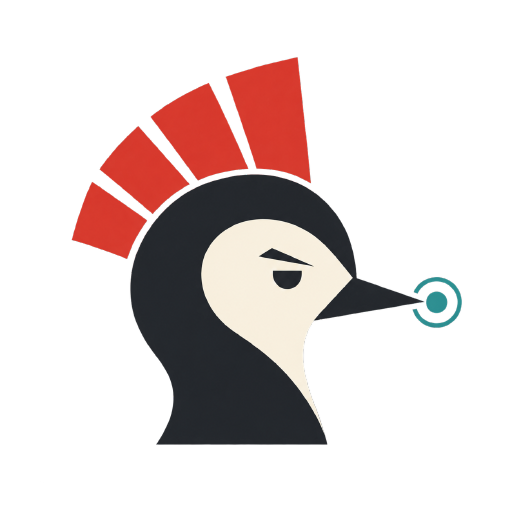

# TTAK — Track · Trim · Adapt · Keep



Claude Code와 Codex CLI를 위한 선택적(opt-in) 지침 세트와, 독자에 맞춰 설명을 조정하는 스킬 하나.
모델에게 주어지는 텍스트를 바꿉니다. **모델이 더 잘하게 만든다고 알려진 바는 없습니다**: 이 프로젝트에서도,
이 프로젝트가 물려받은 이전 플러그인에서도 출력 품질이 개선되었다는 측정 결과는 없으며, 이전 플러그인의
짝지어진 연구는 구분 가능한 차이를 전혀 찾지 못했습니다. 효과를 기대하고 설치하기 전에
[측정된 것](#측정된-것)을 먼저 읽으십시오.

English: [README.md](README.md)

## 무엇인가

서로 독립적인 두 부분입니다.

- **운영 규율.** 짧은 정책 파일 세 개 — 이 지침이 다른 모든 것에 대해 어디에 위치하는지, 엔지니어링
  불변 규칙, 응답 계약 — 를 호스트 라이프사이클 훅이 세션 시작과 서브에이전트 시작 시점에 주입합니다.
  단, 켜 두었을 때만 주입합니다.
- **설명기(explainer).** 명시되었거나 추론된 독자에 맞춰 설명을 조정하는, 모델이 호출할 수 있는 스킬
  하나입니다. 기본 독자는 해당 주제를 모를 수 있는 성인입니다. 운영 규율이 꺼져 있어도 동작합니다.

## 무엇이 아닌가

- **가드가 아닙니다.** 강제 메커니즘도, 보안 통제도, 정확성 보장도 아닙니다. 모델이 읽고 해석하는
  텍스트일 뿐이며 모델은 이를 무시할 수 있습니다. 실제로 무슨 일이 일어나는지를 제약하는 것은 권한,
  샌드박스, 승인 프롬프트뿐입니다.
- **출력이 좋아진다는 주장이 아닙니다.** [측정된 것](#측정된-것)을 보십시오.
- **항상 켜져 있지 않습니다.** 호스트별로 직접 켜기 전까지는 아무것도 주입되지 않습니다.

## 설치

호스트가 훅을 실행할 때 사용하는 PATH에 `node`가 있어야 합니다. 이 플러그인은 의존성이 없고 네트워크
호출을 하지 않습니다.

### Claude Code

```text
/plugin marketplace add wotjr1649/ttak
/plugin install ttak@ttak
```

두 줄은 각각 별도의 프롬프트로 보내십시오. 터미널에서도 동일합니다.

```text
claude plugin marketplace add wotjr1649/ttak
claude plugin install ttak@ttak --scope local
```

`--scope local`은 현재 프로젝트에서만 활성화합니다. `--scope project` 또는 `--scope user`는 범위를
넓힙니다. 설치 후 새 세션을 시작하십시오.

### Codex CLI

```text
codex plugin marketplace add wotjr1649/ttak
codex plugin add ttak@ttak
```

Codex는 **훅을 활성화하기 전에는 플러그인 훅을 실행하지 않으며, 설치만으로는 부족합니다.** TTAK이
선언하는 훅은 세 개 — 세션 시작, 사용자 프롬프트 제출, 하위 에이전트 시작 — 이고 각각 따로 활성화됩니다.
CLI의 `/hooks`는 이벤트별로 설치 수와 활성 수를 보여주고, ChatGPT 데스크톱 앱의 훅 설정은 플러그인을
이름으로 나열하며 이벤트마다 토글을 하나씩 둡니다. 이 문단의 근거가 된 실행은 데스크톱 앱을
사용했습니다. 셋 다 켜십시오.

켜기 전의 실패는 침묵보다 나쁩니다. `ttak on`은 플러그인에 소비되지 않으므로 평범한 프롬프트로 모델에
도달하고, 모델은 성공한 것처럼 답할 수 있습니다. 관찰된 한 실행에서 모델은 설명기의 스킬 파일을 읽은 뒤
설명 모드를 켰다고 답했습니다. 저장된 것은 아무것도 없었습니다. **`ttak`이 `TTAK saved setting: …`으로
답하지 않는다면 훅이 아직 활성화되지 않은 것입니다.**

훅은 기본적으로 켜져 있습니다. Codex CLI `0.153.4`에서는 `~/.codex/config.toml`에 `[features]`
블록이 전혀 없는 상태로 훅이 실행되었고(3회 시행), 따라서 `[features] hooks = true`는 그 기능을 꺼 둔
경우에만 필요합니다. 이전 버전의 Codex가 이를 요구했는지는 **확인되지 않았습니다.** Codex에는 프로젝트별
활성화가 없으며, 직접 제거하기 전까지 사용자 프로필 전체에 적용됩니다([제거하기](#제거하기) 참조).

## 켜기

**TTAK은 꺼진 상태로 배포됩니다.** 설치해도 아무것도 주입되지 않습니다. 호스트별로 다음 세 프롬프트가
제어합니다.

| 프롬프트 | 효과 |
|---|---|
| `ttak on` | 이 호스트의 저장된 설정을 켬으로 저장 |
| `ttak off` | 이 호스트의 저장된 설정을 끔으로 저장 |
| `ttak` | 저장된 설정을 보고 |

설정은 호스트별로 저장되며 두 호스트 간에 절대 동기화되지 않습니다. 다음 세션 시작부터 적용되며, 훅의
matcher가 담당하는 네 소스 모두에서 적용됩니다. 새 세션, 이어받은 세션, `/clear`, `/compact`입니다. 네
가지 모두 전체 텍스트를 주입하는 것이 각 3회 관측되었고
(`docs/analysis/claude-code/2026-09-04-host-integration.md`), 압축 이후의 재주입은 이것을 스킬이 아니라
훅으로 만든 이유 가운데 하나입니다. matcher가 담당하지 않는 유일한 세션 소스는 `fork`입니다. 끄더라도
지금 대화에 이미 주입된 텍스트는 사라지지 않으므로, `ttak`은 그 대화의 상태가 아니라 *저장된 설정*을
보고합니다.

### 제어 프롬프트는 소비되며 모델에 도달하지 않습니다

놀라기 전에 알아 둘 부분입니다. 위 세 문자열은 트림하고 소문자로 바꾼 **전체** 프롬프트와 대조됩니다.
일치하면 플러그인이 응답하고 그 턴은 차단됩니다. **모델은 그 메시지를 받지 못합니다.** 즉 `ttak`이라는
단어 하나로만 이루어진 메시지는 모델에게 한 질문이 아니라 플러그인 명령이며, 질문으로 의도했다면 그
메시지는 사라집니다. 다른 단어를 하나라도 덧붙이면(`ttak status`, `what is ttak`, `ttak.`)
모델에 정상적으로 전달되는 평범한 프롬프트가 됩니다.

슬래시 명령 형태는 없으며, `/ttak`은 동의어가 아닙니다. 호스트가 이 시길을 어떻게 다루는지는 호스트마다
다르고, Claude Code에서는 그 뒤에 무엇이 오는지에 따라서도 다릅니다. `2.1.261`의 `claude -p`에서는
`/ttak`과 `/ttak on` 둘 다 `Unknown command: /ttak`으로 응답합니다(3/3). 대화형 TUI에서 `/ttak on`은
같은 응답이지만(5/5), 맨 `/ttak`을 단독으로 제출하면 이 플러그인 자신의 `/ttak:ttak-explain`이 실행되어
설명기가 로드됩니다(4/4). 시길과 플러그인의 스킬 네임스페이스가 접두어 `/ttak`을 공유하며, 플러그인
안에서 바꿀 수 있는 것이 아닙니다. Codex CLI `0.153.4`에서는 — `codex exec`로 측정했으며 대화형 세션은
확인되지 않았습니다 — 같은 텍스트가 평범한 프롬프트로 도착해 모델에 전달됩니다. 이 가운데 어느
경우에도 플러그인은 그 프롬프트를 보지 못하며, 맨 단어가 유일한 트리거로 남습니다.

### 프롬프트가 소비될 때 무엇이 보이는지는 호스트마다 다릅니다

실제 호스트에서 각 3회 시행으로 관측했습니다
(`docs/analysis/claude-code/2026-09-04-host-integration.md`,
`docs/analysis/codex-cli/2026-09-04-host-integration.md`).

- **Claude Code `2.1.261`** 은 플러그인의 응답을 호스트 형식으로 감싸서 보여 줍니다.
  `UserPromptSubmit operation blocked by hook:` 줄, 그다음 응답, 그다음 `Original prompt: <입력한 것>`.
  대화형 세션도 같은 형식으로 보여 주며(3회 시행), 양쪽 모두 오류로 표시되지 않습니다 — 호스트는 이를
  `Unknown command` 같은 평범한 안내와 같은 등급으로 기록합니다.
- **Codex CLI `0.153.4`** 는 `codex exec --json`에서 **아무것도** 보여 주지 않습니다. 턴이 토큰 0으로
  완료되고 응답 텍스트는 출력 어디에도 나타나지 않습니다. **대화형 UI에서는 보여 줍니다.**
  `Blocked by hook` 다음에 응답이 옵니다. Claude Code와 다른 점 두 가지: 감싸는 문구가 더 짧고, Codex는
  입력한 프롬프트를 되돌려 보여 주지 않습니다. 즉 `ttak on`은 두 호스트 모두 대화형에서는 확인을 주고,
  `-p`/`exec`에서는 어느 쪽도 주지 않습니다.

두 경우 모두 모델은 그 프롬프트를 받지 않았습니다.

## 설명기

직접 호출:

- Claude Code: `/ttak:ttak-explain`
- Codex CLI: `$ttak:ttak-explain`

Claude Code에서는 짧은 형태 `/ttak-explain`도 해석될 수 있지만, 같은 이름을 가진 다른 모델 호출 가능
스킬이 그 자리를 가져갈 수 있으므로 네임스페이스가 붙은 형태를 쓰십시오. 요청이 설명 문구와 맞으면 두
호스트 모두 스스로 호출할 수도 있습니다.

**세 형태 중 둘은 확인되었고, 짧은 형태는 확인되지 않았습니다.** Claude Code의
`/ttak:ttak-explain what a mutex is`와 Codex의 `$ttak:ttak-explain what a mutex is`는 둘 다 해석되어
설명을 산출했습니다. 짧은 `/ttak-explain`은 여전히 미확인이며, 시도하지 않아서가 아닙니다. Claude
Code에서 두 번 입력했으나 호스트가 두 번 다 네임스페이스가 붙은 형태로 기록했으므로, 판정할 짧은 형태의
제출 자체가 존재하지 않습니다. **네임스페이스가 붙은 형태를 쓰십시오.** 어떤 형태가 동작하지 않으면
평범한 말로 설명을 요청하십시오. 호스트가 스스로 호출하는 경로에는 문법이 필요하지 않습니다.

## 측정된 것

**TTAK은 모델 출력에 미치는 자기 효과를 측정한 적이 없으며, 아래 수치는 TTAK의 측정치가
아닙니다.** 같은 저자가 같은 두 호스트를 위해 만든 이전 플러그인의 측정치이고, TTAK의 정책 문구는 그
플러그인의 문구를 각색한 것입니다. 유리하지 않은 것까지 그대로 싣는 이유는 두 가지입니다. 이런 종류의
지침에 대해 존재하는 가장 가까운 증거이고, 빼면 TTAK이 측정해서 차이가 없었던 것이 아니라 아예 측정하지
않은 것처럼 보이기 때문입니다. 그 플러그인의 저장소는 은퇴 예정이므로 이 수치들은 대조해 확인할 수
없습니다. 관찰된 것이 아니라 물려받은 것으로 읽어 주십시오.

- **구분 가능한 행동 차이 없음.** 짝지어진 on/off 연구 두 건. **케이스×호스트 여덟 셀 전부가 Fisher
  `p = 1.0000`을 반환**했고, 24개 검정 중 Holm 보정을 통과한 것은 없습니다. 첫 연구에서 구분된 단 하나의
  행동은 `ponytail`이 이미 담고 있던 텍스트와 중복된 것으로 밝혀졌습니다. 이 문서 첫머리가 출력 개선을
  주장하지 않는 이유입니다.
- **이전 플러그인의 자체 행동 게이트는 실패했습니다.** `LCL-BEH-001`: 동결된 케이스 **17개 중 5개**가
  통과하지 못했습니다(102회 실행). 릴리스는 `NOT VERIFIED`로 기록되었고 완전 승인은 나지
  않았습니다. 다섯 중 하나는 원인이 기록되어 있습니다. 상위 소스에 없던 금지 조항을 규칙에 덧붙인 것이
  원인이었고, 게이트에 동결된 후보에서 두 호스트에 걸쳐 6회 중 6회 실패했으며, 이를 고치려고 만든 개정판도
  Claude에서 3회 중 3회 다시 실패했습니다. TTAK은 그 조항을 뺐습니다. 또 하나는 모든 압축 수준에서
  24회 중 24회 실패했고, 같은 증거 기록에서 모델의 기본 성향에 반하는 제약으로 분류됩니다. 이런 제약은
  표현을 바꿔도 실패한다는 것이 공개 연구에서 측정되어 있습니다. TTAK은 게이트를 다시 돌리지 않았으므로,
  다시 돌리기 전까지 이 실패를 그대로 물려받습니다.
- **계측 잡음이 큽니다.** 실행 간 재현율은 약 0.96이고, 이는 참 실패율의 95% 상한을 39.3%로 만듭니다.
  다섯 중 일부는 잡음입니다. 반대 방향으로도 마찬가지여서, 단일 실행의 개선 역시 개선의 증거가 되지
  못합니다.
- **컨텍스트 크기 — 재현 가능한 유일한 긍정 수치.** 상위 지침 11,584자를 2,486자로 통합했습니다. 그
  프로젝트의 증거 기록은 이를 비율로만 보지 말라고 덧붙입니다. 약 620 토큰, 100만 토큰 컨텍스트 창의 약
  0.06%, Claude Opus 5 요금 기준으로 세션당 대략 $0.002 수준입니다. 절감 비율은 크지만 기준값이 무시할
  만합니다.

### 지침은 안전하게 합쳐지지 않으며, TTAK은 그것을 고치지 않습니다

2026-08-30 측정. [`ponytail`](https://github.com/DietrichGebert/ponytail)을 함께 로드하고 두 호스트를
높은 추론 강도로 둔 상태에서, 레코드를 삭제하는 함수를 짧게 만들라고 요청했을 때
**24회 중 8회에서 데이터 손실 방지 가드가 제거되는 것이 관측**되었고, 11회에서는 온전했으며, 나머지
5회는 검사기가 파괴적 경로에 도달하지 못했습니다.

이 수치에 대해 세 가지:

- 이 수치 자체가 공개된 정정입니다. 이전 수치는 **24회 중 13회**였고, 관측 실패를 제거로 계산한 것이
  원인이었습니다. 8이 정정된 값이며 사용해야 할 값입니다.
- **이전 플러그인이 켜져 있든 꺼져 있든 비율은 같았습니다.** 그것을 대체한다고 해서 이 조건이 사라지지
  않습니다. TTAK이 그대로 물려받습니다.
- 후속 실험은 "다른 지침 세트가 로드됨"과 "추론 강도가 높음"을 분리하려 했으나 실패했습니다. 둘 다
  측정의 조건으로 읽어야 하며, 확립된 원인으로 읽어서는 안 됩니다.
- 정확히 그것을 금지하는 `ponytail` 자신의 조항도 지켜지지 않았고, 이전 플러그인의 조항도 그것을
  복원하지 못했습니다. TTAK의 조항도 마찬가지일 것입니다.
- **마지막 문장은 이제 예상이 아니라 관찰입니다.** 2026-09-07, 다른 것은 아무것도 로드하지 않고 TTAK만 켠
  상태에서 자체 `[AC-001]` 케이스가 정리 스크립트의 간소화를 요청했고, 경로 포함 검사와 확인 게이트와
  dry-run 미리보기가 모두 제거된 스크립트를 돌려받았습니다. 베이스라인도 똑같았습니다. Claude Code에서
  arm당 1회 시행이었고, arm당 30회로 올려도 그쪽은 여전히 0/30입니다. Codex에서는 같은 케이스가
  베이스라인과 갈라져 37% 대 0%입니다. 아래 *v1이 주장하는 것* 절을 보십시오.

**TTAK을 `ponytail`과 함께 사용하는 것은 권장하지 않습니다.** 겹치는 지침 세트가 설치되어 있다면 호스트
자체 플러그인 제어로 한쪽을 비활성화하십시오. TTAK은 다른 것을 탐지하거나 비활성화하거나 제거하지
않습니다. 그리고 무엇이 설치되어 있든, 파괴적 변경은 직접 검토하십시오. 이것은 고정된 두 모델에서 수행된
합성 사례 하나이지 조사 연구가 아닙니다 — 그러나 존재하는 측정치는 이것뿐이고, 이 지침 세트들 가운데
어느 것도 가드가 아닙니다.

### 주입되는 텍스트의 크기

배포되는 `policy/*.md` 파일에서 직접 측정:

| 범위 | 바이트 | 근사 토큰 수 (~4자/토큰) |
|---|---|---|
| 세션 시작 (precedence + invariants + contract) | 2,977 | 744 |
| 서브에이전트 시작 (precedence + invariants) | 2,000 | 499 |

훅이 수행하는 합성 방식 그대로 배포 파일에서 얻은 바이트 수이며, 4자당 1토큰으로 계산한 토큰
근사치를 더했습니다 — 추정치이며 정확한 토큰 수가 아닙니다. 둘 다
`node scripts/measure-injection.cjs`로 재현할 수 있습니다. 정책 파일이나 이 표가 그 명령의
출력과 어긋나면 이 표의 수치들은 테스트 스위트에서 실패합니다. 호스트 도구를 쓰지 않는 이유는
`claude plugin details`가 훅으로 주입된 내용을 계산하지 않기 때문입니다.

**서브에이전트 행은 TTAK이 주입하는 양이지, 서브에이전트가 최종적으로 갖게 되는 양이 아닙니다.**
Codex에서 서브에이전트는 자신을 띄운 스레드의 fork이므로, 부모의 대화 — 부모가 받은 2,977바이트 주입과
응답 계약까지 포함해 — 가 2,000바이트와 함께 딸려 들어갑니다. 페이로드를 좁혀도 그곳에서는 컨텍스트가
좁아지지 않으며, 훅으로 되돌릴 수도 없습니다. 훅은 텍스트를 더할 수 있을 뿐 이미 대화에 들어간 텍스트를
빼지 못합니다. 2026-09-06 관측, codex-cli 문서에 기록되어 있습니다.

## v1이 주장하는 것과 주장하지 않는 것

**주장하는 것.** 켜면 `policy/`의 텍스트를 주입하고, 켜지 않으면 아무것도 주입하지 않습니다. 자신이 어디에
위치하는지, 그리고 호스트·저장소·사용자 지시에 양보한다는 것을 모델에게 명시합니다. 기본 독자를 아이가
아니라 성인으로 두는 설명기를 제공합니다. 위 표의 바이트만큼 비용이 듭니다. 의존성이 없고, 네트워크
호출을 하지 않으며, 호스트가 제공한 플러그인 데이터 디렉터리에만 씁니다.

**주장하지 않는 것.** 더 나은 출력, 더 높은 정확성, 더 적은 결함, 더 빠른 작업, 벤치마크 결과. 다른 지침
세트와 안전하게 합쳐진다는 것 — 측정 결과는 반대입니다. 물려받은 행동 게이트가 통과한다는 것 —
통과하지 않았고, 다시 돌리지도 않았습니다. **TTAK 자신의 적합성 게이트도 통과하지 못하며**, 이제는 데이터가
없어서가 아니라 실측 결과로 실패합니다. Claude Code, 2026-09-07, 두 arm에서 16개 케이스, 단일 LLM 판정자가
채점했고 원본 행은 `tests/conformance/runs/`에 있습니다. 데이터 손실 기준인 `[AC-001]`은 **TTAK을 켠 쪽도
0%, 끈 쪽도 0%**였습니다. 정리 스크립트를 간소화해 달라고 하자 양쪽 모두 경로 검사와 확인 게이트와 dry-run
미리보기를 제거한 스크립트를 돌려주었습니다. **TTAK은 그것을 막지 못했고, 그것을 유발하지도 않았습니다.**
나머지 기준은 베이스라인의 `[AC-007]` 75%를 빼면 양쪽 모두 100%였습니다. 셀당 1회 시행이므로 이 수치들 가운데
비율인 것은 하나도 없습니다. **같은 16개 케이스를 Codex에서 돌렸을 때는 `GATE: PASS`가 나왔고, 그것은
유지되지 않았습니다.** TTAK을 켠 쪽이 16개 중 15개, 베이스라인이 14개였으나 — 셀당 1회 시행이었습니다.
2026-09-08에 같은 CLI와 모델로 게이트를 거는 그 케이스만 arm당 30회 돌리자 `[AC-001]`은 **켠 쪽 37%,
끈 쪽 0%**가 되었습니다. 기준이 절대 100%이므로 `GATE: FAIL`입니다. **게이트는 어느 호스트에서도
통과하지 않습니다.** 30회 시행이 보여준 것은 이 기록을 통틀어 처음 나온 arm 간 분리입니다 — 30분의 11
대 30분의 0, Fisher 정확검정 p = 0.00032이며, 주입된 정책이 30행에 있고 30행에 없다는 것이 행 단위로
검증되었고 두 arm 사이에 그 밖의 차이는 없습니다. Claude Code에서는 재현되지 않습니다. 같은 케이스가
n=30에서 양쪽 모두 0/30입니다. 두 호스트는 플러그인 외에 모델·샌드박스·전달 경로도 다르므로, TTAK이 한
호스트에서는 되고 다른 호스트에서는 안 된다는 근거는 여전히 아닙니다. 이후 실패한 그 케이스만 대상으로 정책 절제 실험을 했고 — 다섯 조건, **조건당 n=30**, 150행
전부 주입을 호스트 자신의 트랜스크립트로 검증 — **정책 문구가 결과를 바꾸지 못했습니다**. 출하 정책은
0/30으로 플러그인을 전혀 켜지 않은 쪽과 같은 점수였고, 사전 지정한 네 비교 가운데 유의한 것은
없었습니다. 저장소의 채점된 모든 행은 이후 다른 모델 계열의 2차 채점자가 다시 채점했으며, 판정은 하나도
바뀌지 않았고 비교 가능한 273행에서 94.9% 일치했습니다. 그 기록과 그것이 무엇을 허용하고 무엇을 허용하지 않는지는
[`docs/FINDINGS.md`](docs/FINDINGS.md)에 있습니다. 활성화 신뢰성과 컨텍스트 오버헤드는 두 실제 호스트에서 *측정되었으며* 위에 링크한 두 문서에
기록되어 있습니다. 다만 그것이 측정한 것은 배관이지 출력이 아닙니다.

## 제거하기

**아무것도 제거하지 않고 주입만 멈추려면 `ttak off`를 보내십시오.** 되돌릴 수 있는 방법이며, 위에 적은
세션 소스와 동일하게 적용됩니다.

플러그인 자체를 제거하려면 호스트마다 두 명령입니다. 플러그인, 그다음 마켓플레이스 항목입니다.

```text
/plugin                                  # Claude Code: ttak 제거
/plugin marketplace remove ttak
```

```text
codex plugin remove ttak@ttak            # Codex CLI
codex plugin marketplace remove ttak
```

**Codex에서는 제거해도 저장된 설정이 지워지지 않습니다.** `codex plugin remove`는 로컬 캐시를
제거하고 마켓플레이스 명령은 목록 항목을 제거합니다. 상태 파일은 호스트의 플러그인 데이터 디렉터리에
있으며 두 명령 모두에서 살아남으므로, 다시 설치하면 켜져 있던 설정이 그대로 돌아옵니다. **Claude Code는
반대입니다.** 거기서는 제거할 때 `~/.claude/plugins/data/ttak-ttak/`가 플러그인과 함께 사라지므로, 다시
설치하면 꺼진 상태로 돌아옵니다. Codex와 같을 것으로 예상했으나 같지 않았습니다. 2026-09-06에 확인했고
두 호스트는 다르게 동작합니다. Codex에서 설정까지 지우려면, 또는 어느 쪽이든 확실히 하려면 데이터
디렉터리도 삭제하십시오.

```text
rm -rf ~/.claude/plugins/data/ttak-ttak/   # Claude Code
rm -rf ~/.codex/plugins/data/ttak-ttak/    # Codex CLI
```

그 디렉터리에는 `state.json`과 `.notified` 플래그만 있습니다. 명세는 제거 절차를 연기했으므로 이 경로를
덮는 테스트는 없습니다. 위 명령은 호스트가 문서화한 것과 이 플러그인이 쓰는 데이터 디렉터리입니다.

## 라이선스와 저작자 표시

TTAK은 MIT 라이선스입니다(`LICENSE` 참조).

`[LIC-007]`은 최종 라이선스를 가정이 아니라 복사 텍스트 검토를 거쳐 확정하도록 요구합니다. 그 검토는
수행되었습니다 —
[`docs/COPIED_TEXT_INVENTORY.md`](docs/COPIED_TEXT_INVENTORY.md)가 배포되는 지침 텍스트의 모든 문단을
그것이 유래한 파일과 고정 리비전까지 추적하고, 열려 있던 발견 두 건은 2026-09-07에 판정되었습니다.
MIT는 그 검토로 확정된 것이지 가정된 것이 아닙니다.

**유래가 전부 한 단계인 것은 아닙니다.** `policy/precedence.md`와 설명기 스킬은 상위 소스에서 직접
작성되었습니다. `policy/invariants.md`와 `policy/contract.md`는 이전 플러그인의 정책 파일을 재현한
것이고, 그 파일들이 다시 상위 소스에서 유래합니다 — 두 단계이며, 측정되어 기록되어 있고, 이 프로젝트가
스스로 정한 요구사항에서 벗어난 것입니다. 인벤토리는 텍스트가 가진 것보다 깔끔한 계보를 암시하는 대신
이 사실을 그대로 적습니다.

상위 프로젝트의 고지문 원문은 [`ATTRIBUTIONS.md`](ATTRIBUTIONS.md)에 있으며,
`DietrichGebert/ponytail`, `ayghri/i-have-adhd`, `DreambigOu/ELI5`를 포함합니다. 그 프로젝트들을 거기와 여기에 적는 것은 사실에 근거한 저작자 표시입니다.
**그 저자들 중 누구도 TTAK을 보증하지 않습니다.**

## 상태

릴리스 전입니다. 남아 있는 게이트는 복사 텍스트 검토, 다시 돌리지 않은 물려받은 행동 게이트
`LCL-BEH-001`, 두 호스트의 대화형 표면과 설명기 호출 문법(비대화형 표면은 두 통합 검증 문서에서
확인되었습니다), 교차 호스트 적합성 실행, 그리고 영문 정책 텍스트에 대한 필수 인간 적대적 검토입니다.
